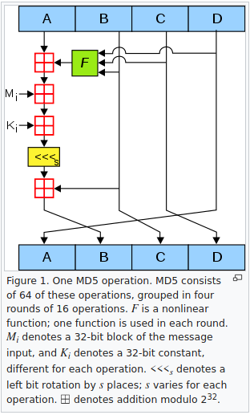
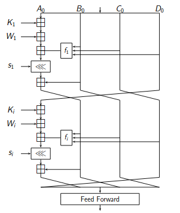
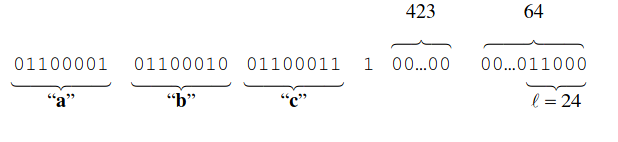
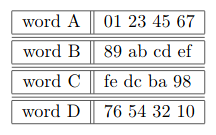

# Overview.md
Overview.md is this file. This file was requested in a revision of the project requirements. The requirements were changed amid the COVID-19 crisis. This pandemic meant we would not be able to meet our lecturer again to do a presentation. This file will outline:
* what the project is
* how to run it
* a look at the algorithm used,

and
* the complexity of the code.

# Introduction
This project is part of my fourth year of Software Development. It is part of the Theory of Algorithms module. The aim of this project is to develop a program that hashes an input using the MD5 algorithm which is explained in the [RFC 1321](https://tools.ietf.org/html/rfc1321) document.

# Run
This section will outline how to clone, compile and run the program for yourself. I developed this program using Linux but i will outline my experience running my program on Windows.
I unfortunately couldn't get my hands on a macOS/OSX system for testing but I assume it will be a similar experience as on Linux.
### Running on Linux
Linux has a native/pre-installed C compiler so there is no need to install one.
* open up a terminal
* navigate to where you want the project in the file directory using ```cd/{{directory name}}``` and ```cd .. ``` to go back a directory.
* Run ```git clone https://github.com/markgill17/TOA-project.git```
* Search for name of new directory using ```ls```
* Navigate to the directory you just cloned using ```cd /TOA-project```
* Run ```gcc TOA-project/md5.c -o md5``` to generate the md5 from my code.
* Run ```./md5 -s "YOUR TEST STRING"``` to get the MD5 hash of the string you inputted

### Running on Windows
My way of running a C compiler on Windows was to install a Linux subsystem.
I followed the steps found [here](https://ubuntu.com/tutorials/tutorial-ubuntu-on-windows#1-overview). Once those are complete, I did this:
* open up the ubuntu terminal
* navigate to where you want the project in the file directory using ```cd/{{directory name}}``` and ```cd .. ``` to go back a directory.
* Run ```git clone https://github.com/markgill17/TOA-project.git```
* Search for name of new directory using ```ls```
* Navigate to the directory you just cloned using ```cd /TOA-project```
* Run ```gcc TOA-project/md5.c -o md5``` to generate the md5 from my code.
* Run ```./md5 -s "YOUR TEST STRING"``` to get the MD5 hash of the string you inputted

# Tests
Run ```./md5 -h (any random string)``` for help.
Run ```./md5 -t (any random string)```
It shows the test subject, expected hash result and actual hash result
I couldn't get this to work with just 2 arguements

# Algorithm

The algorithm used is an MD5. It is used to hash
the input that is passed to it. The output is a 128-bit message-digest. Every input has 1 output and every output is different.

```hello``` produces ```5d41402abc4b2a76b9719d911017c592```
```Hello``` produces ```8b1a9953c4611296a827abf8c47804d7```



Every output is unique. This is to ensure data integrity. The output for a particular input will always be the same. The output will be different if any letter has it's case changed.
An MD5 has is performed in 5 steps.
## Step 1
### Append padding
>> The message is "padded" (extended) so that its length (in bits) is congruent to 448, modulo 512.

It's padded to the point of being 64 bits shy. Padding always has to happen even if it is already 448 bits.
"1" is appended to message and then "0"s are added until is congruent to 448.



## Step 2
### Append length
The original length of the message is represented as 64 bits. This is then appended to the result of the last step. This equates to the exact length 512. This is a multiple of 16, 32 bit words.

## Step 3
### Initialize MD Buffer
A four-word buffer (A,B,C,D) is used. All 4 are 32 bits. They have the following hex values:
word A: ```01 23 45 67```
word B: ```89 ab cd ef```
word C: ```fe dc ba 98```
word D: ```76 54 32 10```



## Step 4
### Process Message in 16-Word Blocks
4 functions are created. They each take in 3 words(32 bits each) and return a word(32 bits).
Operators:
```
& bitwise AND
| bitwise inclusive OR
^ bitwise XOR (exclusive OR)
<< left shift
>> right shift
~ bitwise NOT
```
RFC describes these 4 functions as:
```
F(X,Y,Z) = XY v not(X) Z  
X AND Y OR NOT X, AND Z  

G(X,Y,Z) = XZ v Y not(Z)  
X AND Z OR Y AND NOT Z  
 
H(X,Y,Z) = X xor Y xor Z  
X XOR Y XOR Z  
 
I(X,Y,Z) = Y xor (X v not(Z))
Y XOR X OR NOT Z
```

## Step 5
### Output
The message digest produced as output is A, B, C, D. We start with A and end with D.

# Complexity
MD5 extends MD4. MD4 is said to be quicker but MD5 is said to be more likely to be more secure. MD5 runs at a Big O notation of O(n)[3]. This result means the speed is mainly affected by the length of the message passed to it. MD5, due to it's better security, had an over 10 year longer shelf life.

## Attacks
A collision attack is when multiple outputs are compared to see if they're the same. This is done to see if 2 hashed passwords have the same result, then you know the passwords are the same.
## How to counter
The most common counter measure is a salt. A salt is when you grab the hash of an input, then add a random set of characters, then hash it again.

# References
* https://tools.ietf.org/html/rfc1321
* https://learnonline.gmit.ie/course/view.php?id=557
* https://gist.github.com/creationix/4710780
* http://practicalcryptography.com/hashes/md5-hash/
* https://rosettacode.org/wiki/MD5#C
* https://dox.ipxe.org/md5_8c_source.html
* https://nvlpubs.nist.gov/nistpubs/FIPS/NIST.FIPS.180-4.pdf